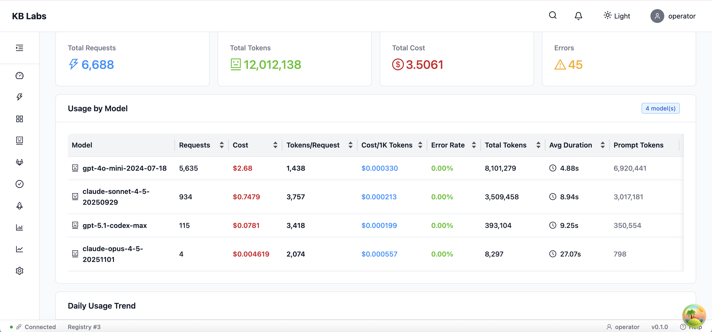
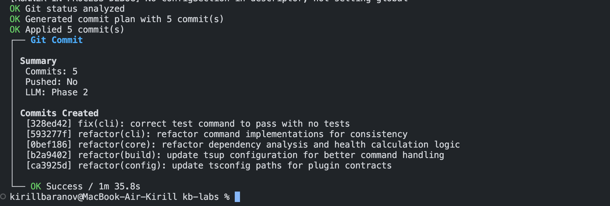

<h1 align="center">
  
</h1>

<p align="center">
  <strong>Engineer · System Thinker · Platform Builder</strong>
</p>

<p align="center">
  I build engineering systems, internal platforms, and developer tooling.<br/>
  My focus is on scalability, reliability, and reducing cognitive load for engineers and teams.
</p>

---

## 🧠 What I focus on

- Internal platforms and developer experience (DX)
- Engineering systems and tooling
- Architecture of complex products and monorepos
- Automation, orchestration, and quality gates
- AI-assisted development as an engineering system, not a toy

I'm interested in problems where architecture, processes, and tooling matter more than individual features.

I care less about specific frameworks and more about how systems behave over time: how they evolve, break, recover, and scale with teams.

---

## 🛠 Tools & Technologies

I'm not attached to specific stacks — I work with whatever solves the problem best.

Currently working with:


Previously: Vue 2/3, Webpack, Vite, Vitest, Playwright, and more.

The tools change. The thinking stays.

---

## 🧭 Experience

**~4.5 years at Forpeople** — HR-tech startup, later acquired by **Kaspersky**.

Joined at an early stage. Responsible for frontend direction:
- Built frontend architecture on top of a legacy codebase
- Led migration from Vue 2 to Vue 3
- Designed internal UI modules and a dynamic form builder
- Participated in team formation and engineering processes

The most valuable part wasn't the tech — it was working inside a growing product: balancing speed, quality, and long-term maintainability while the company and requirements were changing.

This shaped how I think about internal platforms, tooling, and engineering systems today.

---

## 🧪 Current focus — KB Labs

**[KB Labs](https://github.com/KirillBaranov/kb-labs)** is an open-source engineering platform I'm building to accelerate development and introduce new approaches to how teams work.

It's not a demo — I use it daily for real development work.

<p align="center">
  
  
  
</p>

<p align="center">
  
</p>

```
                    ┌─────────────────┐
                    │    Studio UI    │
                    └────────┬────────┘
                             │
        ┌────────────────────┼────────────────────┐
        │                    │                    │
        ▼                    ▼                    ▼
   ┌─────────┐         ┌──────────┐         ┌─────────┐
   │   CLI   │◄───────►│ REST API │◄───────►│ Plugins │
   └─────────┘         └────┬─────┘         └─────────┘
                            │
        ┌───────────────────┼───────────────────┐
        │                   │                   │
        ▼                   ▼                   ▼
   ┌─────────┐         ┌─────────┐        ┌──────────┐
   │  Mind   │         │ Agents  │        │ Workflow │
   │  (RAG)  │         │         │        │  Engine  │
   └─────────┘         └─────────┘        └──────────┘
        │                   │                   │
        └───────────────────┼───────────────────┘
                            ▼
                     ┌────────────┐
                     │ Analytics  │
                     └────────────┘
```

<table>
  <tr>
    <td width="50%">
      <strong>Core</strong>
      <ul>
        <li>Unified CLI, REST API, and UI</li>
        <li>Plugin-based architecture</li>
        <li>Multi-tenant support</li>
      </ul>
    </td>
    <td width="50%">
      <strong>AI & Automation</strong>
      <ul>
        <li>RAG-based code navigation</li>
        <li>Agent orchestration (model-agnostic)</li>
        <li>Cost-aware AI usage & analytics</li>
      </ul>
    </td>
  </tr>
</table>

**Goal:** Make development more predictable, observable, and cheaper — without vendor lock-in.

<p align="center">
  
  <br/>
  <sub>Studio UI — AI usage analytics with cost tracking per model</sub>
</p>

<p align="center">
  
  <br/>
  <sub>CLI — AI-powered commit generation with conventional commits</sub>
</p>

This is where I experiment, fail, rebuild, and validate ideas before applying them in production.

---

## 📊 What I measure

- **TTM** — time-to-market
- **Cognitive load** — how much engineers need to hold in their heads
- **Cost of change** — how expensive is it to modify the system
- **Workflow reliability** — how often engineering processes fail
- **AI ROI** — real return on AI-assisted development

If something cannot be measured or reasoned about, it's usually a bad engineering decision.

---

## 🔓 Open the Closed

My philosophy — and the mission behind KB Labs.

The industry is moving toward closed platforms and vendor lock-in. I'm building in the opposite direction.

**For engineers:** Tools should help you work better and produce higher quality output — reducing friction, not adding it. You deserve to choose what you use.

**For companies:** Control your costs, own your automation, and switch providers without rewriting everything. Your infrastructure shouldn't hold you hostage.

I believe:
- Systems fail, but good systems recover
- Abstraction should serve real use cases, not hypothetical ones
- Most engineering pain comes from poor boundaries, not lack of talent
- AI is useful only when embedded into deterministic systems and processes

I prefer boring, explainable systems that scale — over clever hacks.

**Open, composable, self-hostable.** That's the direction I'm building toward.

---

## 📬 Let's connect

[](https://www.linkedin.com/in/k-baranov/)
[](https://t.me/kirill_baranov)
[](https://t.me/kirill_baranov_official)
[](https://habr.com/ru/users/kirill_baranov/)
[](mailto:kirillBaranovJob@yandex.ru)

<sub>📍 Moscow · UTC+3</sub>

Building in public — development backstage, thoughts, and experiments in my [Telegram channel](https://t.me/kirill_baranov_official).

---

**Open to:**
- 🔍 Architecture & process audits — reviewing systems, identifying bottlenecks, improving DX
- 💼 Full-time roles — Staff/Principal Engineer, Platform Architect, or Engineering Lead positions

If you're building internal platforms, scaling engineering teams, or rethinking development processes — let's talk.
